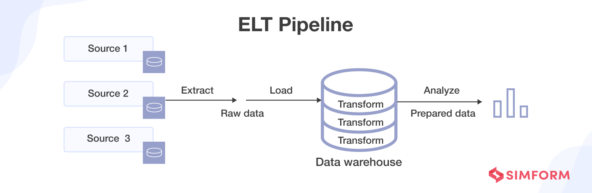

## ELT-Pipeline-RandomPersonAPI
### Author: Jayden Lee(jaydenhyunjinlee@gmail.com)
 This ELT pipeline achieves: 
  - Collection randomly generated personal data from `https://randomuser.me/api/`, 
  - Staging datasets in remote object-storage servervia `MiniO`
  - Process, clean, and abstraction of datasets via `python`
  - Ingestion into target `postgres`-based DW environment

 These tasks are scheduled/orchestrated using `Airflow` DAG API



## Contents
- [Overview](#overview)
- [How to deploy](#how-to-deploy)
- [Repository Structure](#repository-structure)
- [Conclusion](#conclusion)

---

## Overview
 This project is inspired from my passion of wanting to learn how to build a fully-automated end-to-end data pipeline from getting the data, staging those data, and ingesting those data into the target database after parsing that can be deployed on any machine. 
 
 To stream and parse data, Python program was used to fetch open source API data source by making 10 recurring GET requests over 4 threads.

 As a staging area to store the raw and processed datasets, [MiniO](https://min.io/) was used to store the data in JSON format as objects.

 [Airflow](https://airflow.apache.org/) was employed for orchestrating the overall workflow of the whole data pipeline as well as scheduling the execution period, logging, and automation.

 Last but not least, the program gets executed in [Docker](https://www.docker.com/) multi-container environment in which all components share subnet ranges and the host machine. This allows the program to be deployed to any machine where Docker is installed.

---
## How to deploy
1. First you'd want to set up your environment variables required. You can achieve so by filling out `./.env` file with required credentials

2. Next you'll need to spin up all services using `docker compose` command:
```bash
docker compose up -d
```

3. You can modify the DAG while having the locally hosted Airflow scheduler instance running. To do so, go to `./dags/mainDAG.py` and update the values in `default_args`

---
## Repository Structure
```
ELT RandomPersonAPI
│   README.md
│   poetry.lock(Only when running the app locally)
│   .gitignore
│   Dockerfile
│   docker-compose.yaml
│   dags
│   main.py
└───src
│   │   __init__.py
│   │   utils.py
│   │   Generate.py
│   │   Parse.py
│   │   Ingest.py 
└───dags
│   │ mainDAG.py
└───img
    │   elt_pipeline.png
```

---
## Conclusion
With this ELT pipeline, you will be able to locally host your automated batch data pipeline that collects randomly-generated personal infos from `https://randomuser.me/api`